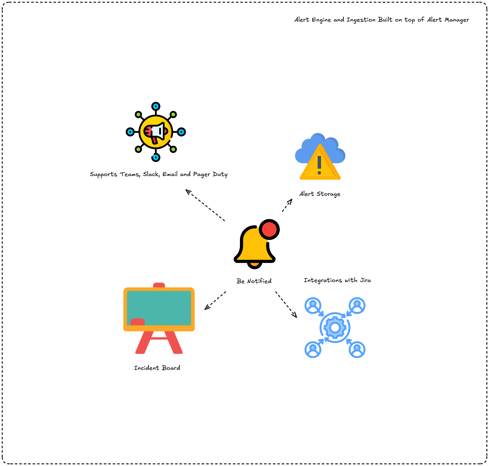

# BeNotified

Internal alerting and incident service for Be Observant. Powered using Alert Manager



## Purpose

Be Notified owns the alerting domain:
- Alert rules and Mimir ruler sync
- Incident lifecycle and notes
- Notification channels and delivery
- Jira integration
- Alertmanager webhook ingestion

Main `beobservant` remains the public API, permission, scope, and audit authority and proxies alertmanager endpoints to BeNotified.

## Runtime

- Service port: `4323`
- Internal base path: `/internal/v1`
- Health: `/health`
- Readiness: `/ready`

## Authentication

For internal API calls from main service:
- `X-Service-Token: <shared-token>`
- `Authorization: Bearer <context-jwt>`

For direct Alertmanager webhooks:
- Bearer token via `INBOUND_WEBHOOK_TOKEN`

## Required environment

- `BENOTIFIED_DATABASE_URL`
- `BENOTIFIED_EXPECTED_SERVICE_TOKEN` (or `GATEWAY_INTERNAL_SERVICE_TOKEN`)
- `BENOTIFIED_CONTEXT_VERIFY_KEY` (or `BENOTIFIED_CONTEXT_SIGNING_KEY`)
- `BENOTIFIED_CONTEXT_ISSUER`
- `BENOTIFIED_CONTEXT_AUDIENCE`
- `BENOTIFIED_CONTEXT_ALGORITHMS`
- `INBOUND_WEBHOOK_TOKEN`
- `MIMIR_URL`
- `ALERTMANAGER_URL`
- `DATA_ENCRYPTION_KEY` (recommended)

See repository root `.env.example` for full configuration.

## Notes

- TLS is optional (`BENOTIFIED_TLS_ENABLED=false` by default).
- Deploy on an internal network only.
- BeNotified keeps operational logs; authoritative user audit is in main service.

## Testing

```bash
pytest -q
```

When contributing from the BeObservant mono-repo root, `.pre-commit-config.yaml`
runs this BeNotified test suite together with all other service and UI checks
before each commit.
